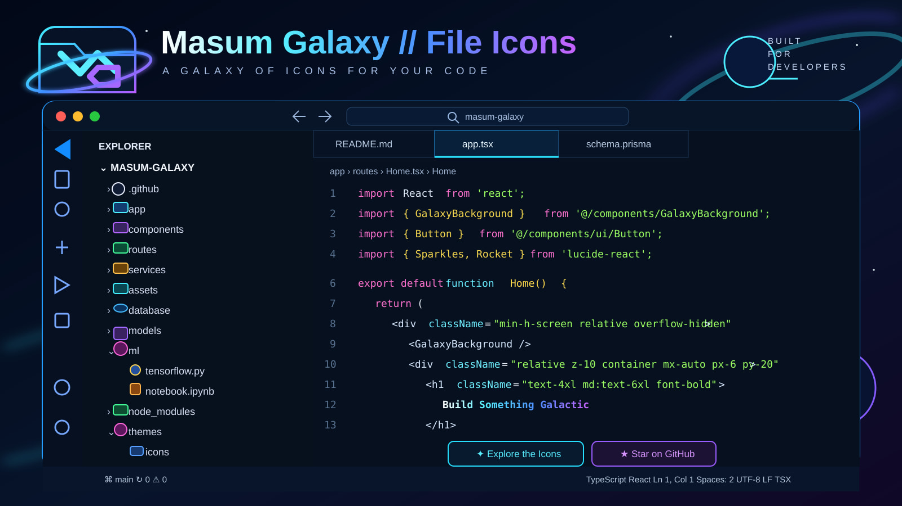

# Masum Galaxy // File Icons

A futuristic, galaxy-inspired **VS Code File Icon Theme** by **Masum Billah**.

**Free · MIT · Web + Full Stack + AI/ML + DevOps**

The pack is designed to match the **Masum Galaxy** ecosystem: dark space surfaces, cyan/violet neon energy, compact glowing details, and clear technology-specific accent colors.

## Current release — 1.3.2

Version **1.3.2** adds the final Marketplace branding set: the official **MG Galaxy folder-orbit logo**, a wide Marketplace hero banner, and a dedicated Explorer preview image.

The current pack covers modern web development, full-stack projects, databases, AI/ML and DevOps. It includes dedicated icons for technologies such as React, Next.js, Vite, Tailwind CSS, Node.js, Python, Prisma, PostgreSQL, MongoDB, Firebase, Jupyter Notebook, TensorFlow, PyTorch, Docker, Supabase, Vercel, Netlify and Kubernetes.

## Explorer Preview



Special Galaxy folder icons cover common project structures including:

```text
src
app
pages
components
routes
services
lib
config
database / db / migrations
prisma
models
ml / ai / notebooks
assets / images
public / static
themes
icons
tests / __tests__
api
utils / helpers
hooks
styles / css
workflows
.vscode
node_modules
supabase
.github
```

Model-file mappings include `.pt`, `.pth`, `.onnx`, `.pkl`, `.pickle`, `.joblib`, `.h5` and `.tflite`.

## Install locally

```powershell
cd "D:\OneDrive\Web Development\Galaxy-VS-Code-File-Icon"
git pull
npm.cmd install
npx.cmd vsce package
code --install-extension .\masum-galaxy-file-icons-1.3.2.vsix --force
```

Then activate:

```text
Ctrl + Shift + P
→ Preferences: File Icon Theme
→ Masum Galaxy // File Icons
```

If cached icons remain visible:

```text
Developer: Reload Window
```

## Marketplace preparation

Marketplace metadata, official branding assets, README showcase images, and the OIDC trusted-publishing workflow are now included. Publishing details are documented in [PUBLISHING.md](PUBLISHING.md).

## Visual direction

- dark navy / black surfaces
- cyan-to-violet neon outlines
- strong technology-specific accent colors
- recognizable shapes at small Explorer sizes
- subtle Galaxy styling without making the sidebar visually noisy

## Links

- Repository: https://github.com/gitwithmasum/Galaxy-VS-Code-File-Icon
- Issues: https://github.com/gitwithmasum/Galaxy-VS-Code-File-Icon/issues

## License

MIT
